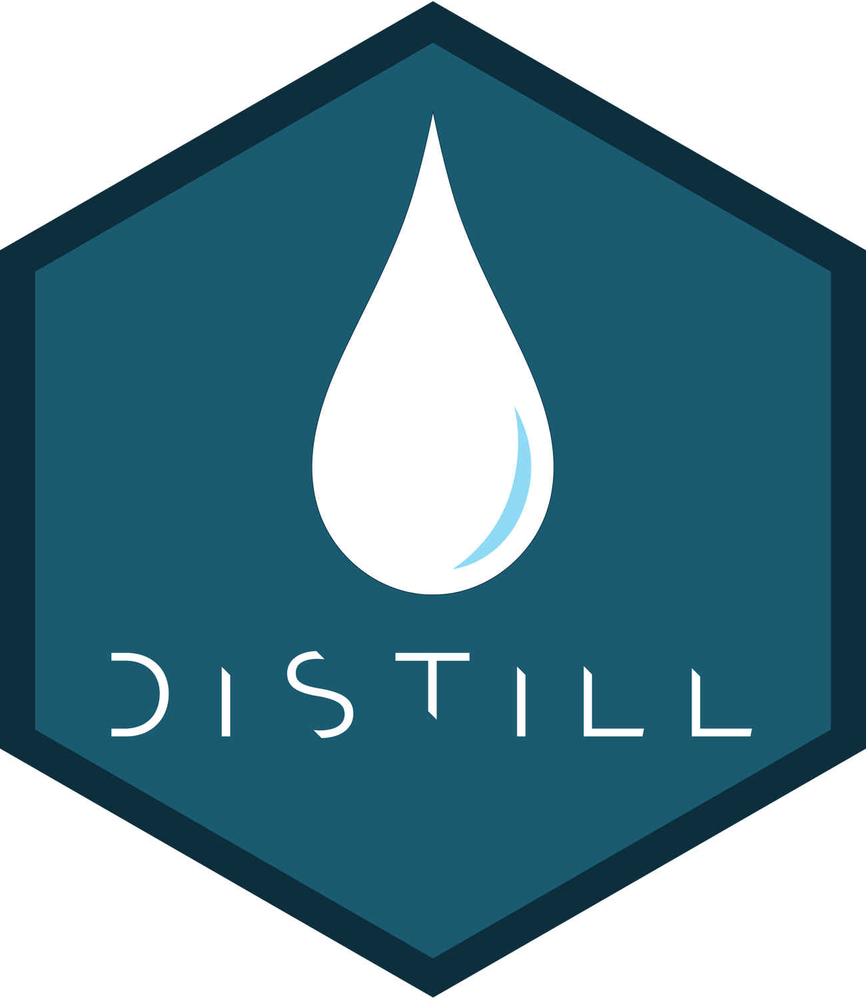

```{r setup, include=FALSE}
knitr::opts_chunk$set(echo = FALSE)
```

# Promises kept
When I launched this website, [I promised two things](https://twitter.com/jvieroe/status/1487867621877952515): 

1. that I wouldn't write yet another guide to creating and publishing a website using the [{distill}](https://distillery.rbind.io) package for R
2. but instead share some of the existing resources that I had found useful when creating this very website -- my first site ever (and, by implication, my first site created in R)

In this post I will keep the second promise.

As a general resource, __[The Distillery](https://distillery.rbind.io)'s guide ['Creating a Website'](https://rstudio.github.io/distill/website.html) contains everything you need__ every step of the way. Nevertheless, below I provide links to some of the other stuff that helped me.

<center>

{width=50%}

</center>


## Distill 101

Prior to launching this site, I had no experiencing with web management and creating a site from scratch. This is one of the reasons why {distill} had such a strong appeal: it seemed like a [simple and clean framework](https://werk.statt.codes/post/2021-02-24-hellodistill/) that would allow me to do everything in R.

* To get me started, I found [Andreas Handel](https://www.andreashandel.com)'s ['Create a GitHub website with distill in less than 30 minutes'](https://distillery.rbind.io/posts/2021-03-21-create-a-github-website-with-distill-in-less-than-30-minutes/) incredibly helpful
* [Thomas Mock](https://github.com/jthomasmock)'s ['Building a blog with distill'](https://themockup.blog/posts/2020-08-01-building-a-blog-with-distill/) also provides a lot of useful tips and tricks


<br>

## Customizing your theme

As someone new to CSS, one of the things that drew me towards {distill} was the fact that it's an [opinionataed framework](https://stackoverflow.com/questions/802050/what-is-opinionated-software). This means that there is less customization that you _can do_. It also means, however, that there is less customization you _have to do_ before you have a nice-looking site.

* The Distillery's [Showcase](https://jhelvy.github.io/distillery/showcase) section is an amazing resource. There are so many cool (and cool-looking) sites on there and their open source code means that you can allow yourself to be inspired by their theme -- and, more importantly, how they arrived at it!
* I still don't really know CSS but I managed to piggyback from some great existing sites, including those of [Harry Fisher](https://www.hfshr.xyz), [Shannon Pileggi, PhD](https://www.pipinghotdata.com), and [Etienne Bacher](https://www.etiennebacher.com)


<br>

## Other features

* If you want help to set up giscus, a [free, open-source commenting system](https://github.com/giscus/giscus) for blogs/websites that are built using the GitHub API, look no further than [Joel Nitta](https://twitter.com/joel_nitta)'s tutorial ['Enable giscus in Distill'](https://distillery.rbind.io/posts/2021-11-24_using-giscus/)
* I used [Thomas Mock](https://github.com/jthomasmock)'s guide ['Including and meta tagging extra content in a distill blog'](https://themockup.blog/posts/2021-03-21-including-and-meta-tagging-extra-content-in-a-distill-blog/), The Distillery's guide on ['Article Metadata'](https://rstudio.github.io/distill/metadata.html#twitter-card) , and [this Twitter thread](https://twitter.com/kaija_bean/status/1450975170923950081) to help me set up and adjust the preview appearance of my site when sharing links on Twitter, GitHub etc.

<br>


# Good luck!

I hope these links will prove useful in case you decide to give {distill} a chance! Also, make sure to check out The Distillery's continuously updated [Tips & Tricks](https://distillery.rbind.io/tips_and_tricks.html) site.

<br>

<center>

__Enjoy coding your new website!__

{width=75%}

</center>