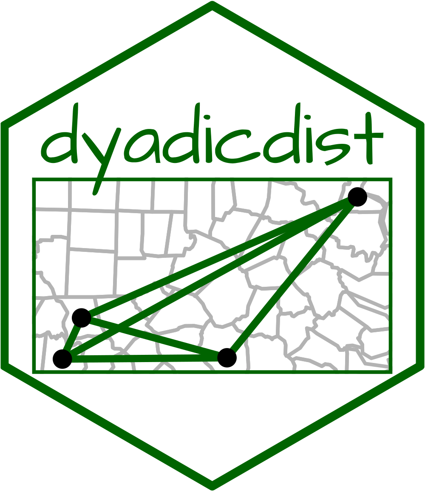
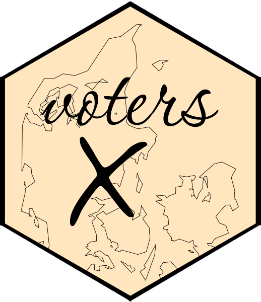

```{r setup, include=FALSE}
knitr::opts_chunk$set(echo = FALSE)
```

```{r, include=FALSE, results='asis'}
library(metathis)

meta() %>%
  meta_social(
    title = "jvieroe: R packages",
    description = "Code, Plots, and All Things R",
    url = "https://jvieroe.github.io",
    image = "https://raw.githubusercontent.com/jvieroe/jvieroe.github.io/main/images/sl_plot.png",
    image_alt = "Serial development",
    og_type = "website",
    og_author = "Jeppe Vierø",
    twitter_card_type = "summary_large_image",
    twitter_creator = "@jvieroe"
  )
```


## dyadicdist 

:::: {style="display: grid; grid-template-columns: 20% 80%; grid-column-gap: 10px; line-height: 1.5rem;"}

::: {}
```{r out.width='85%', out.extra='style="float:left; padding-left:5px; padding-right:5px"'}

```
:::

::: {}

* **Released** (version 0.3.1) &ensp; <i class="fa fa-check"></i> 

* The purpose of `dyadicdist` is to provide quick and easy calculation of dyadic distances between geo-referenced points

* The main contribution of `dyadicdist` is that the output is stored as a long, dyadic tibble as opposed to a wide matrix

* Accepts single and dual data inputs

[](https://lifecycle.r-lib.org/articles/stages.html#experimental)
[](https://github.com/jvieroe/dyadicdist)
[](https://github.com/jvieroe/dyadicdist/actions)
[](https://app.codecov.io/gh/jvieroe/dyadicdist?branch=main)

<a href="https://github.com/jvieroe/dyadicdist" target="_blank"><i class="fab fa-github"></i> View on GitHub</a>

:::

::::

<br>


## ricardo 

:::: {style="display: grid; grid-template-columns: 20% 80%; grid-column-gap: 10px; line-height: 1.5rem;"}

::: {}
```{r out.width='85%', out.extra='style="float:left; padding-left:5px; padding-right:5px"'}

```
:::

::: {}

* *In progress* &ensp; <i class="fa fa-spinner fa-spin"></i> 

* `ricardo` provides access to data on historical football matches from <a href="https://www.football-data.co.uk/data.php" target="_blank">Football-Data.co-uk</a>


[](https://lifecycle.r-lib.org/articles/stages.html#experimental)
[](https://github.com/https://github.com/jvieroe/ricardo)
[](https://github.com/jvieroe/ricardo/actions)

<a href="https://github.com/jvieroe/ricardo" target="_blank"><i class="fab fa-github"></i> View on GitHub</a>

:::

::::

<br>

## voters 

:::: {style="display: grid; grid-template-columns: 20% 80%; grid-column-gap: 10px; line-height: 1.5rem;"}

::: {}
```{r out.width='85%', out.extra='style="float:left; padding-left:5px; padding-right:5px"'}

```

:::

::: {}

* **Released** (version 0.1.0) &ensp; <i class="fa fa-check"></i> 

* Use `voters` to get (spatial) data on Danish polling stations from <a href="https://dawadocs.dataforsyningen.dk" target="_blank">Danmarks Adressers Web API (DAWA)</a>
* The provided `id` variable allows you to link the individual polling stations to election data from the <a href="https://valgdatabase.dst.dk/?lang=en" target="_blank">Danish Election Database</a>

[](https://lifecycle.r-lib.org/articles/stages.html#stable)
[](https://github.com/https://github.com/jvieroe/voters)
[](https://github.com/jvieroe/voters/actions)
[](https://app.codecov.io/gh/jvieroe/voters?branch=main)

<a href="https://github.com/jvieroe/voters" target="_blank"><i class="fab fa-github"></i> View on GitHub</a>

:::

::::

<br>

## claudius 

:::: {style="display: grid; grid-template-columns: 20% 80%; grid-column-gap: 10px; line-height: 1.5rem;"}

::: {}
:::

::: {}

* *In progress* &ensp; <i class="fa fa-spinner fa-spin"></i> 
* `claudius` is inspired by the <a href="https://github.com/walkerke/tigris" target="_blank">`tigris`</a> package and serves as centralized source of spatial data on Danish political, administrative, and geographic units
* `claudius` returns <a href="https://r-spatial.github.io/sf/" target="_blank">simple features objects</a>

[](https://github.com/jvieroe/claudius/actions)

<a href="https://github.com/jvieroe/claudius" target="_blank"><i class="fab fa-github"></i> View on GitHub</a>

:::

::::

<br>


## racketeer 

:::: {style="display: grid; grid-template-columns: 20% 80%; grid-column-gap: 10px; line-height: 1.5rem;"}

::: {}
:::

::: {}

* *In progress* &ensp; <i class="fa fa-spinner fa-spin"></i> 
* `racketeer` provides easy access to tennis stats such as ATP/WTA rankings and matches

[](https://github.com/https://github.com/jvieroe/racketeer)
[](https://github.com/jvieroe/racketeer/actions)
[](https://app.codecov.io/gh/jvieroe/racketeer?branch=main)
[](https://www.codefactor.io/repository/github/jvieroe/racketeer)
[](https://cran.r-project.org/web/licenses/MIT)
[](https://lifecycle.r-lib.org/articles/stages.html#experimental)
[](https://github.com/jvieroe/racketeer/commits/main)


<a href="https://github.com/jvieroe/racketeer" target="_blank"><i class="fab fa-github"></i> View on GitHub</a>

:::

::::

<!-- ### Internal packages -->

<!-- Beyond the packages listed above, I have developed the following packages that provide unified corporate visual identities for `ggplot2` objects: -->


<!-- * <a href="https://github.com/jvieroe/repinion" target="_blank"><i class="fab fa-github"></i> repinion</a> -->
<!-- * <a href="https://github.com/jvieroe/epinionDSB" target="_blank"><i class="fab fa-github"></i> epinionDSB</a> -->


<!-- <br> -->
<br>

<!-- ## dyadicdist -->

<!-- ::: {.floatting} -->

<!-- ```{r out.width='25%', out.extra='style="float:left; padding-left:5px; padding-right:40px"'} -->
<!--  -->
<!-- ``` -->

<!-- * **Released** &ensp; <i class="fa fa-check"></i> -->

<!-- * The purpose of `dyadicdist` is to provide quick and easy calculation of dyadic distances between geo-referenced points -->

<!-- * The main contribution of `dyadicdist` is that the output is stored as a long, dyadic tibble as opposed to a wide matrix -->

<!-- * Accepts single and dual data inputs -->

<!-- [](https://lifecycle.r-lib.org/articles/stages.html#experimental) -->
<!-- [-blue.svg)](https://cran.r-project.org/web/licenses/GPL%20(%3E=%203)) -->
<!-- [](https://github.com/jvieroe/dyadicdist) -->
<!-- [](https://github.com/jvieroe/dyadicdist/actions) -->
<!-- [](https://app.codecov.io/gh/jvieroe/dyadicdist?branch=main) -->

<!-- ::: -->

<!-- <br> -->

